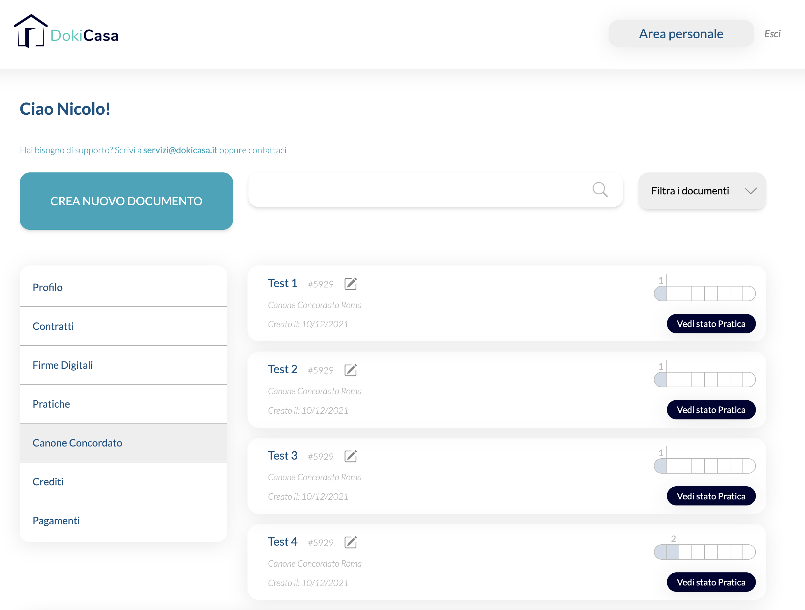
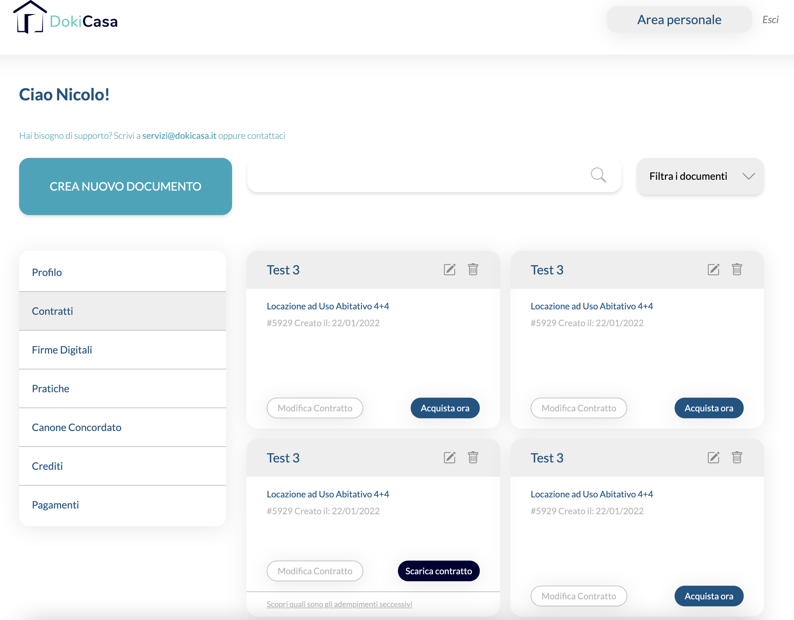
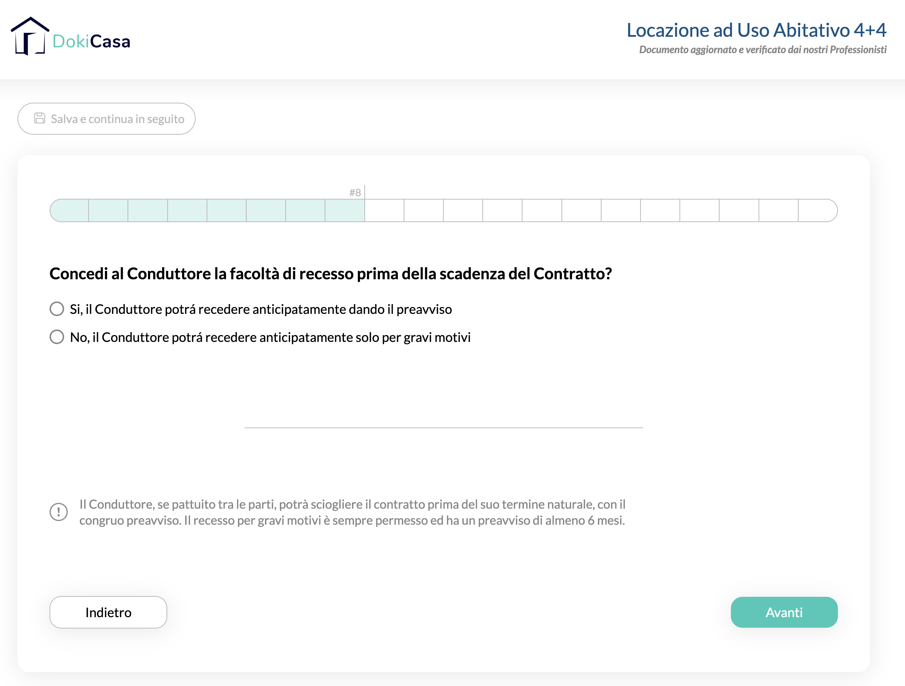
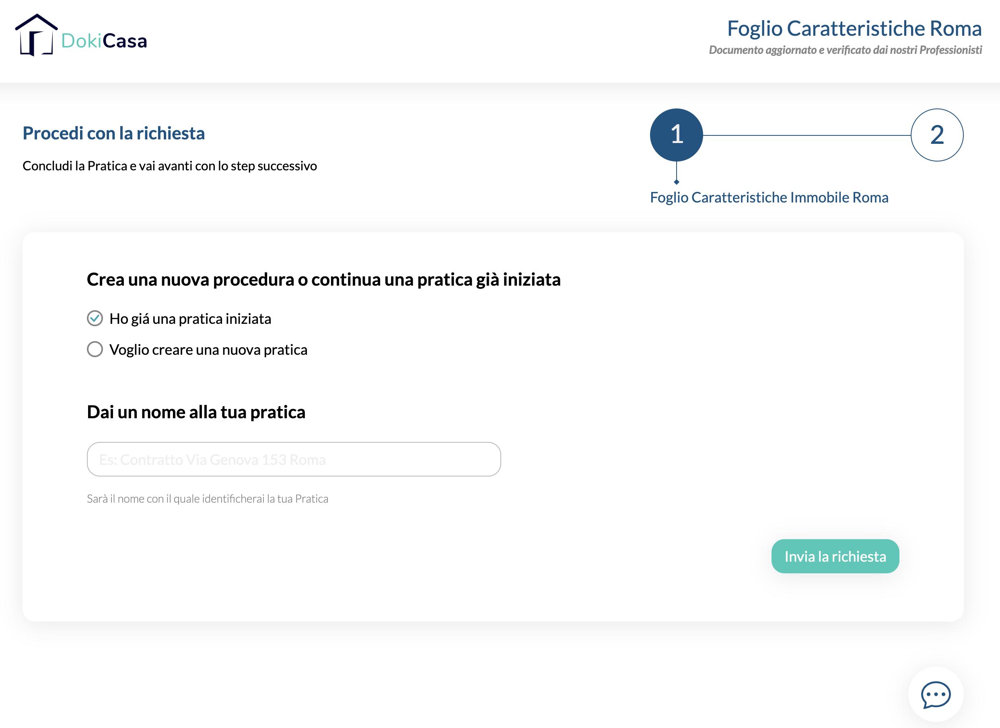

# About this Project

HTML forms for a real estate website. It is based on a Figma design and the implementation is done with TailwindCSS.

## Content
- 26 step Form Wizard
- Dashboard with 19 pages

## Screenshots Examples

